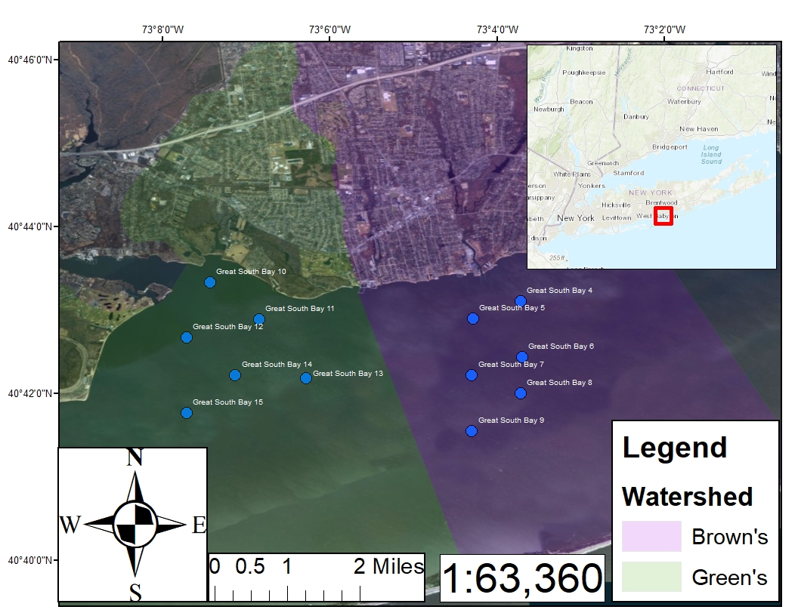
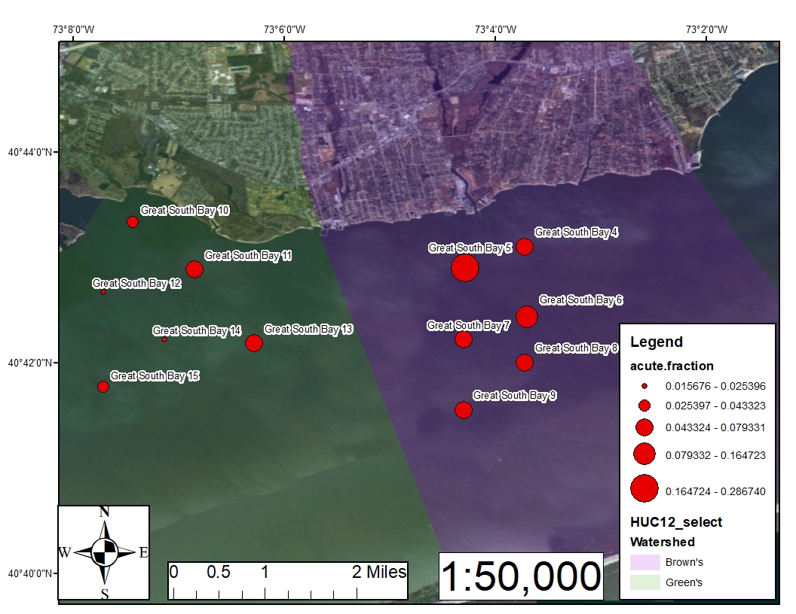

```{r setup, include=FALSE}
knitr::opts_chunk$set(echo = TRUE)
```
# Introduction

## Problem Statement
Dissolved oxygen (DO) is an important indicator of water quality that until recently has been cost-prohibitive to monitor extensively in both space and time. Continuous water-quality data, particularly in coastal environments with  tidal flow, is necessary for resource managers to understand the dynamic changes in water quality that occur tidally, daily, seasonally, and spatially.  Great South Bay, New York is an important ecological system for the the communities of Long Island's southern shore.  During the 1970's, approximately 70% of the United States' shellfishing harvest came from Great South Bay.  Since then, harvests have dwindled due to a multitide of reasons including government restirictions and water quality.   

Low DO concentrations limit the survival of some economically and ecologically valuable species, such as the hard clam.  For this reason, investments for restoration of these species without fully understanding the local water-quality conditions can result in an unsuccessful restoration efforts. Continuous and spatially distributed water-quality data are critical for regulatory agencies to support informed decisions in managing aquatic resources. Specifically, the proposed DO monitoring would provide more complete and accurate information to aid in the classification of water-quality impairments associated with Long Island estuaries as tabulated in the New York State Department of Environmental Conservation (NYSDEC) Waterbody Inventory and Priority Waterbodies List. This list aims to describe water quality and supported water uses, identify problems, and prioritize restorative measures.


## Objectives of this project
The goal of this project is to provide exploratory data analysis of a DO study conducted in 2016 and 2017 by the U.S. Geological Survey, in conjunction with the Nature Conversancy.  Trends in DO concentrations will be evaluated in terms of tidal, diurnal (day/night), seasonal, and spatial influences. 
Data will also be analysed in terms of NYDEC classifications of chronic and acute events. Daily DO averages of under 3.0 mg/L indicate an acute event while concentrations between 3.0 and 4.9 mg/L are allowable for an alotted number of days. These thresholds will be discussed in detail in the following sections.   

## Data collection method
During the warm weather months of 2016-2017, 12 optical sensors deployed in Great South Bay recording salinity (ppm), and dissolved oxygen (mg/L) at 6 minute intervals.  Site locations are represented in the map below. The sensors were periodically serviced by cleaning and recalibrating the sensors, and downloading raw data. The raw DO data was then adjusted for salinity, and corrections for fouling and sensor drift were applied.  




## R packages used
```{r, message=FALSE, warning=FALSE}
library("dataRetrieval")
library("lubridate")
library("tidyverse")
```

# Data preperation
In this section, data is imported into RStudio and tidied to prepare for the exploratory data analysis that follows. The objective of this section is to create two related tables. The first table provides site information and can be thought of a spatial table and describes the locations of the deployed sensors.  The second table will provide a time-series for the period of record at six minute intervals, and includes time-varying descriptive variables.  The two tables are linked by the USGS assigned site number of the sensor locations.     

## Site Information Table 
Information from the 12 sites were loaded into RStudio from the National Water information System (NWIS) database (https://waterdata.usgs.gov/nwis). NWIS is an online database that houses water quality datasets on a national scale. An R package, 'dataRetrieval' was developed to load sets directly into R.  The package is used to site information of the DO study, including the USGS assigned site number (SiteNum) and Station Name (StationName), Latitude (Lat) and Longitude (Long). A variable for watershed was then seperated to indicate the source of contributing surface water.  The SiteNum variable is used as a primary key to relate the site information table (spatial) to the time series table (temporal).    

### Load data from NWIS
```{r}
# USGS assigned site numbers of DO sensors deployed in Great South Bay 
site.numbers <- c("404306073034301", "404254073041701", "404226073034201", "404213073041801", "404200073034301", 
                  "404133073041801", "404320073072601", "404253073065101", "404240073074301", "404211073061701",
                  "404213073070801", "404146073074301")

# import site info from NWIS 
site.info <-readNWISsite(site.numbers)

# select variables of interest and rename columns
site.info <- site.info %>% 
          select("SiteNum"=site_no,
                 "StationName"=station_nm,
                 "Lat"=dec_lat_va,
                 "Long"=dec_long_va)

# Get watershed from Station name
site.info <- site.info %>% 
          separate(StationName,c("StationName","watershed"), sep="near", remove=FALSE)  

site.info$watershed <- site.info$watershed %>%  
                    str_replace(" Browns River, NY","Browns River")

site.info$watershed <- site.info$watershed %>%  
                    str_replace(" Connetquot River, NY","Greens Creek")

site.info$SiteNum <- as.character(site.info$SiteNum)
# glimpse of the site information table
print(site.info)
```


## Dissolved Oxygen Time Series Table
This table contains a continuous time series for each year of the study at 6 minute intervals.


### Load DO data from NWIS
DO data was read in directly from the NWIS database using the dataRetrieval package, providing the USGS assigned site number(SiteNum), dateTime of recorded measurement, and concentration of DO recorded by the sensor in mg/L (DO_mgl).
```{r}
#read in DO time series from NWIS (may take a minute or two to load)
DO.data <- readNWISuv(site.numbers,"00300", "2016-06-01", "2017-11-03") 

#select and rename variables of interest - Site Number, dateTime, and DO concentration 
DO.data <-  DO.data %>% 
            select(SiteNum=site_no, dateTime, DO_mgL=X_00300_00000)

#date/time as posixct
DO.data$dateTime <- as.POSIXct(DO.data$dateTime)

# create a variable for date in YYYY-mm-dd
DO.data$date <- str_extract(DO.data$dateTime,pattern='.{10} ')

# create a variable for date in mm-dd
DO.data$monthday <- format(DO.data$dateTime, '%m-%d')

#siteNum as charcter 
DO.data$SiteNum <- as.character(DO.data$SiteNum)

#glimpse of the preliminary data
head(DO.data)
```
### Add descriptive variables 
Concentrations of Water quality parameters such as DO are influenced by a multitude of factors as described in the introduction.  By adding descriptive variables to the time series we can analyse conditions that lead to DO concentrations.

Date/Time variables
```{r, warning=FALSE}
#Parse the DateTime variable
DO.data <- DO.data %>% 
        separate(dateTime, c('year','month','day','hour','minute'),remove=FALSE)

#include a factor for time of day
DO.data$hour <- as.numeric(DO.data$hour)
DO.data <-  DO.data %>% 
        mutate(tod.fac=ifelse(hour==24 | hour==1 | hour==2 | hour==3 | hour==4 | hour==5 | hour==6 |  hour==23,'night','day')) 

# unique value for observation number
DO.data$obs.id <- seq(from=1,to=nrow(DO.data),by=1)

```

Tide Stage 
The estuaries of Long Island, including Great South Bay are tidally influenced, as freshwater from surface runoff and groundwater contribution, mix with saltwater from the Atlanctic Ocean. Here, classifications of tide stage are derived.  

Methodology: classify one tide cycle in 4 stages of tide condition. High tide to high tide is 12 hours and 25 minutes based on observation. Classifications include the following stored as factors - high tide/falling tide, high tide/rising tide, low tide/rising tide, low tide/falling tide, and are created by cutting a tide cylce interval into equal parts.   The cycle is then repeated for the rest of the time series, and joined to the main DO time series table by joining by the dateTime variable.  
  

1. 2017 tide stage factor
```{r}
# create a dummy vector tide time series that will joined to the main table

## the tide cycle starts at high tide as indicated at a nearby monitoring site
start.cycle <- as_datetime('2017-06-02 05:00:00', tz='EST')

## the first tide cycle ends at the next high tide
end.cycle <- as_datetime('2017-06-02 17:42:00', tz='EST')

## the tide time series ends 
end.2017 <-  as_datetime('2017-11-09 04:54:00', tz='EST')


ts.cycle <- seq(from=start.cycle,to=end.cycle,by= '6 min')
ts.2017 <- seq(from=start.cycle,to=end.2017,by= '6 min')

# cut interval into 4 equal piece for 1 tide cycle - repeat 6 times to reset remainder - repeat for lenght of survey (~300 tide cycles)
tide.2017 <- data.frame(stage=rep(rep(cut_interval(ts.cycle, n=4,
                                                  labels=c('High.falling','low.falling','low.rising','high.rising')),6),50), dateTime=ts.2017)

```

2. 2016 year tide data
The same steps as described above were used to create 2016 tide factors
```{r}
# create a dummy vector to cut 
start.cycle <- as_datetime('2016-06-02 07:48:00', tz='EST')
end.cycle <- as_datetime('2016-06-02 20:30:00', tz='EST')
end.2016 <-  as_datetime('2016-11-09 07:42:00', tz='EST')
ts.cycle <- seq(from=start.cycle,to=end.cycle, by= '6 min')
ts.2016 <- seq(from=start.cycle,to=end.2016,by= '6 min')

# cut interval into 4 equal piece for 1 tide cycle - repeat 6 times to reset remainder - repeat for lenght of survey (300 tide cycles)
tide.2016 <- data.frame(stage=rep(rep(cut_interval(ts.cycle,
                                              n=4,
                                              labels=c('High.falling','low.falling','low.rising','high.rising')),6),50),
                                              dateTime=ts.2016)
```

3. combine tide.2016 and tide.2017
```{r}
# row bind 2016/2017 tide factor time series
tide <- rbind(tide.2016,tide.2017)

# join back to the DO data dataframe
DO.data <- left_join(DO.data, tide, by = "dateTime")


#compare with actual tide elevation data from a nearby NWIS site - check for phase continuity - USGS tide site "01306402"
# plot recorded tide elevation and check colored tide stage descriptor for continuity  
# 2017

# import tide data for a randomly selected tide cycle in 2017
watch.hill2 <- readNWISuv("01306402","62619", startDate = '2017-07-02', endDate ='2017-07-03',tz="EST")

tide.test2 <- DO.data %>% 
          left_join(watch.hill2,by='dateTime') %>% 
          filter(!is.na(X_62619_00000))


ggplot(tide.test2,aes(x=dateTime,y= X_62619_00000,color=stage)) + 
                                                            geom_point() + 
                                                            facet_wrap(~month, scales = 'free')+
                                                            xlab('Date-Time [EST]') +
                                                            ylab('Water Elevation [m]')
                                                                    
                                                            
# The observed tide elevation matches with tide stage classification to a reasonable degree
```


Water Temperature  
Water temperature is provided from a nearby monitoring station, but is only available for 2017. 
```{r}
wt <- readNWISuv("01306402","00010", startDate = '2017-06-02', endDate ='2017-11-03',tz="EST") %>% 
  select(dateTime,water.temp=X_00010_00000)

DO.data <- DO.data %>% 
        left_join(wt, by="dateTime")
```

# Exploratory Data Analysis
In this section, DO data will be explored, primarily using visualizations generated from the ggplot2 package. 

## Summarizing by year
The table and scatterplot below shows daily averages of DO during 2016 and 2017 for the months 2016 and 2017. An overall lower DO trend is seen in the later part of August particularly. 
```{r}

DO.data %>% 
  filter(month %in% c('08','09')) %>% 
  group_by(monthday,year) %>% 
  summarize(inst.mean=(mean(DO_mgL))) %>% 
  ggplot(aes(x=monthday,y=inst.mean, color=year)) + 
    geom_jitter() + 
    xlab('Date') +
    ylab('DO [mg/L]') + 
    scale_x_discrete(breaks= c('08-07','08-14','08-21','08-28','09-04','09-11','09-18','09-25'))
    
# Table of yearly averages by watershed
DO.data %>% 
  left_join(site.info,by="SiteNum") %>% 
  group_by(watershed,year) %>% 
  summarize(mean=mean(DO_mgL)) %>% 
  spread(watershed, mean)     
  
```


## Summary of Time of Day by year and watershed
Further yearly trends are depicted in the bar graph below as the data are categorized by month, and dodged with watershed, and faceted by time of day. The Green River watershed had consistently higher DO averages for both years. The Brown Creek watershed shows a different pattern between years, with DO dropping between July and August. 
```{r, warning=FALSE, message=FALSE}


#By month 
x2 <- DO.data %>% 
      filter(month %in% c('07','08','09','10')) %>% 
      left_join(site.info,by="SiteNum") %>% 
      group_by(watershed,month, year,tod.fac) %>% 
      summarize(site.meanDO=mean(DO_mgL))

x2 %>% 
  ggplot(aes(x=month,y=site.meanDO,fill=watershed)) + 
                geom_bar(stat='identity', position='dodge') + 
                facet_grid(~year) + 
                scale_fill_manual("watershed", values =c("cadetblue3","darkolivegreen3")) + 
                theme_minimal() +
                ylab('DO [mg/L]') + 
                xlab('Month of Year')
```

## Distribution of Time of Day by year and watershed
The dotted lines in the boxplot below show threshold values 4.9 and 30. mg/L (discussed in more detail later).  Diurnal (day/night) influences are added. The 2016 records are once again lower. Here it can seen that not only are the Brown Creek data lower, but there is also more variation.
```{r}
x4 <- DO.data %>% 
    filter(month==c('07','08','09','10')) %>% 
    left_join(site.info,by="SiteNum") 

              
x4 %>% ggplot(aes(x=watershed,y=DO_mgL)) + 
                geom_boxplot() +
                facet_wrap(tod.fac~year) +
                geom_hline(yintercept = 4.9, size = 1, color = "orange", linetype = "dashed") +
                geom_hline(yintercept = 3.0, size = 1, color = "red", linetype = "dashed") +
                ylab('DO (mg/L)')
```

## Distribution of tide stage by year and month
The effect of tidal influence on DO does not seem to be signifcant according to the boxplot below.  Once again the increased variation of the 2016 data, particularly September and October is seen.
```{r}
x5 <- DO.data %>% 
  left_join(site.info,by="SiteNum") %>%
  filter(!is.na(stage)) %>% 
  group_by(watershed,stage,month, year) %>% 
  summarize(meanDO=mean(DO_mgL,na.rm=T),WT=mean(water.temp, na.rm=TRUE))


x5 %>% ggplot(aes(x=month,y=meanDO, fill=stage)) + 
                              geom_boxplot() +
                              ylab('DO [mg/L]') +
                              xlab('Month of Year') + 
                              facet_grid(year~.)
                              
```


## Distribution of time of day by watershed
The historams below show differences in the distribution of the watersheds.  Green River shows an approximately normal distribtion while Brown Creek has a pronounced skew, resulting in more data points under the 3.0 mg/L threshold.  
```{r, warning=FALSE}
DO.data %>%  
  left_join(site.info,by="SiteNum") %>% 
  ggplot(aes(x=DO_mgL)) + 
            geom_histogram(color= 'azure4', fill='seashell') + 
            facet_wrap(watershed~tod.fac) +
            scale_x_continuous(name = "Dissolved Oxygen [mg/L]",
                                        breaks = seq(0, 12, 3),
                                        limits=c(0, 14)) +                   
            scale_y_continuous(name = "Number of Observations") +
            geom_vline(xintercept = 3.0, size = 1, colour = "red",
                                        linetype = "dashed")   
```

## Probability less than threshold values
Looking at low DO measurement (under 4.9 and 3.0 mg/L) the yearly and spatial trends become apparent. Year 2016 exceeded the thresholds at a higher rate than 2017, and Browns River exceeded them at a higher rate than Greens Creek. It can also be seen that rates of exceedenced decreased after August both years.  
```{r}
x6 <- DO.data %>% left_join(site.info,by="SiteNum") %>% 
                    filter(month==c('08','09','10')) %>%
                    group_by(month,watershed, year) %>%
                    summarize(total_n=n(), 
                              n_lt4.9 = sum(DO_mgL<4.9), 
                              p_lt4.9 = sum(n_lt4.9/total_n),
                              n_lt3.0 = sum(DO_mgL<3.0),
                              p_lt3.0 = sum(n_lt3.0/total_n))

x6 %>% ggplot(aes(x=year, y=p_lt4.9, fill=watershed)) + 
              geom_bar(stat='identity',position='dodge') +  
              facet_grid(~month) + 
              scale_fill_manual("watershed", values =c("cadetblue3","darkolivegreen3")) +
              xlab('Year') +
              ylab('Probability less than 4.9 mg/L')
                                  

x6 %>% ggplot(aes(x=year, y=p_lt3.0, fill=watershed)) + 
              geom_bar(stat='identity',position='dodge') +  
              facet_grid(~month) + 
              scale_fill_manual("watershed", values =c("cadetblue3","darkolivegreen3")) + 
              xlab('Year') +
              ylab('Probability less than 3.0 mg/L')
                                    
                                   
```

## Water temperature 
As water temperature increases, oxygen solubility decreases, which explains some of the trends in DO concentrations presented above. This relationship is visible in the data and shown with a scatterplot of daily averaged DO vs water temperature. Pearson's correlation coefficient is calculated to quantify the relationship.  

```{r}

wt_do_daily <- DO.data %>% 
      left_join(site.info, by='SiteNum') %>% 
      filter(year==2017) %>%
      group_by(date, watershed) %>% 
      summarize(meanDO=mean(DO_mgL,na.rm=TRUE), meanWT=mean(water.temp, na.rm=TRUE))

wt_do_daily %>% 
      ggplot(aes(x=meanWT,y=meanDO, color=watershed)) + 
          geom_point(position='jitter') + 
          geom_smooth(model='lm') +
          xlab('Water Temperature [Celsius]') +
          ylab('Dissolved Oxygen [mg/L')

cor(wt_do_daily$meanDO[-1], wt_do_daily$meanWT[-1], method='pearson')


```


# NYDEC criteria
Criteria for regulatory and management purposes are governed by the New York State Department of Environment Conservation, Division of Water (NYSDEC).  NYSDEC has defined what constitutes a low DO event based on U.S. Environemntal Protection Agency guidelines. Additional information can be found at https://www.dec.ny.gov/docs/water_pdf/togs116.pdf

In this section the DO.data dataframe will be evaluated in terms of NYSDEC guidelines. Chronic and acute DO events will be derived. 

## Chronic Events 
Chronic DO events are defined by NYSDEC as being between 4.8 mg/L and 3.0 mg/L, where concentrations are allowed for a a period of time, dictated by an empirical formula.


The provided equation governing chronic events will evaluated. 

```{r, warning=FALSE}
##Build the theoretical table based on governing equation

# time in days
t.i <- seq(0,60,1)

# function values 
DO.i <- 13.0 / (2.80 + (1.84 * exp(-0.1 * t.i)))

#plot(DO.i~t.i)
x <- cbind(t.i, DO.i) %>% data.frame()

x %>% ggplot(aes(x=t.i, y=DO.i)) + 
    geom_point() +
    xlab('time [days]') + 
    ylab('Dissolved Oxygen [mg/L')


# store as a dataframe
DEC.DO <- data.frame(max.time=t.i, DO.lb=round(DO.i,2))
```

Cut DO values from of the theoretical table
```{r}

# cut intervales 
DEC.DO$DO.lb <- cut_interval(DEC.DO$DO.lb,6)

# lower bound are the lower interval limit
levels(DEC.DO$DO.lb)
lower.bounds <- c(2.8,3.11,3.41,3.72,4.03,4.33)

#replace names of the levels to be the lower bound
levels(DEC.DO$DO.lb) <- lower.bounds 


DEC.DO <- DEC.DO %>% 
  group_by(DO.lb) %>% 
  summarize(max.days=min(max.time))


head(DEC.DO)
```


Minimum daily averages 
Daily averages of DO are calculated at each site and the minimum is returned to capture the lowest daily value. 
```{r}


# find the daily min
daily.avg <- DO.data %>%
                left_join(site.info,by="SiteNum") %>% 
                group_by(SiteNum, date) %>%
                summarize(DO.daily = mean(DO_mgL)) 

# find the min of the daily average
daily.min <- daily.avg %>% 
                  group_by(date) %>% 
                  summarize(DO.daily.min=min(DO.daily)) 

head(daily.min)
```

Find days where daily DO from the DO.data dataframe is between 3.0-4.8 mg/L
```{r}
# filter into a dataframe - one value for each day. Not every day has a value.
DO.chronic <-  daily.min %>% 
            filter(DO.daily.min > 3.0 & DO.daily.min <= 4.64 ) %>% 
            data.frame

# coerce date variable from char into date
DO.chronic$date <- as.POSIXct(DO.chronic$date)

##assign a group number for consective days within threshold

# create a variable and counter 
DO.chronic$group <- NA
j <- 1

# loop through each element 
for(i in 2:nrow(DO.chronic)){
    if(difftime(DO.chronic$date[i],DO.chronic$date[i-1]) == 1){
    DO.chronic$group[i] <- j
    DO.chronic$group[i-1] <- j
   } else{
      j <- j +1}
 }
head(DO.chronic)
```

Chronic violations
```{r}
# cut the min values by the same interval as above
DO.chronic$DO.lb <- cut(DO.chronic$DO.daily.min, c(2.8,3.11,3.41,3.72,4.03,4.33,4.64)) 
levels(DO.chronic$DO.lb) <- lower.bounds

# join the theoretical table
chronic.events <- DO.chronic %>% left_join(DEC.DO, by='DO.lb') %>% 
                  group_by(group) %>% 
                  summarise(start=min(date),   # start day of chronic event
                                  avg=mean(DO.daily.min), # the average DO concentration during the event
                                  event.days=n(),    # the number of days of the event
                                  max.days=min(max.days)) %>%  # the maximum allowable days at the interval
                  mutate(max.days-event.days) %>%  
                  filter(max.days-event.days <= 0)
chronic.events
```
Using the provided criteria, only 5 chronic events were detected for the period of record.

## Acute violations
Crietria: The DO concentration shall not fall below the acute standard of 3.0 mg/L at any time.
```{r}
# assign a boolean variable to indicate if an observation is acute
DO.data$acute <- ifelse(DO.data$DO_mgL < 3.0, TRUE, FALSE)

 
DO.data <- DO.data %>%   
        left_join(site.info, by='SiteNum')

# Fraction of acute observations by site
DO.data %>%
  group_by(SiteNum) %>% 
  summarize(acute.fraction=sum(acute)/n())

# Fraction of acute observations by month
DO.data %>%
  group_by(month) %>% 
  summarize(acute.fraction=sum(acute)/n())

# Fraction of acute observations by watershed
DO.data %>%
  group_by(watershed) %>% 
  summarize(acute.fraction=sum(acute)/n())

# By year 
DO.data %>%
  filter(month %in% c('08','09')) %>% 
  group_by(year) %>% 
  summarize(acute.fraction=sum(acute)/n(), observations = n(), violations=sum(acute))

# Time of day
DO.data %>%
  group_by(tod.fac) %>% 
  summarize(acute.fraction=sum(acute)/n())

```
From the tables, it can be determined that acute events are most common in the month of September, in 2016, and in the Browns River watershed. The map below, created using ArcGIS uses graduated symbols to show sites that had the most common acute violations.



# Conclusions

## Summary
As seen from the exploratory data analysis provided in this project, DO concentrations are dynamic and fluctuate across time and space.  The data indicate that differences between yearly and diuranl cycles.  2016 and 2017 showed differences in DO concentrations, as did values between day and night.  The day/night discrepencies however were not as drastic as anticipated.  There were clearly defined spatial patters seen in the dataset as well, as potentially significant disceprencies were seen between the two watersheds of the study area.Tidal influences appear to not be a major contributing factor.  Water temperature appears to play a major role, as it was highly correlated with DO.  

## Expansion Opportunities
This project could be improved by the acquisition of additional datsets and additional analysis. 
1. The most glaring need is for ecological data, namely a shellfish survey spanning 2016 and 2017, to correlate DO concentrations with ecological health of Great South Bay.   
2. Water temperature data for 2016 would further demonstrate the linkage between DO and temperature.
3. Data from extreme weather events, such as cyclones, could be a potential explanation for some of the acute DO events seen in the datset.  
4. A watershed analysis should be performed on the two watersheds, quantifying possible sources of low DO, such as nitrate and stormwater, by looking at impervious surface converage, septic vs sewered areas, and land use.  

## Value of Analysis
Analysis such as these are important in understanding environmental data.  These data originate mainly from government funded organizations, and it is therefore critical that as much information as possible be garnered from them as possible to maximize value from taxpayer money. Monitoring environmental parameters is time consuming and expensive, yet crucial for the long-term outlook of our communites.  As such, these data need to contribute to improved knowledge so that regulatory agencies can make more informed decisions, applying resources in the most sensible areas.   


